# Machine Learning Notes Database: Expansion & Tagging Roadmap

This document provides a comprehensive plan to organize, tag, and expand your existing Machine Learning and Deep Learning notes vault. The goal is to transform your current collection of 28 notes into a fully connected, highly structured reference database.

---

## 1. Tag Taxonomy Definition

To keep your vault structured, searchable, and clean, we propose a standardized set of tags. Tags should be added on **Line 1** of each file in the format `#tag1 #tag2 ...`.

| Tag | Domain / Focus | Example Connected Notes |
| :--- | :--- | :--- |
| `#deep_learning` | Core neural network architectures, layers, and paradigms | `Attention Mechanism`, `What is MoCo?` |
| `#nlp` | Natural Language Processing, text models, and tokenization | `N-gram Models`, `Predicting Next Word with GPT-2` |
| `#compvis` | Computer Vision, image processing, and spatial models | `Depth Estimation Metrics`, `Fréchet Inception Distance` |
| `#generative` | Generative modeling paradigms (diffusion, energy-based, flow matching) | `Diffusion Models`, `Energy based Models` |
| `#optimization` | Model training, fine-tuning, objective functions, and scaling | `Low Rank Adaptation(LoRA)`, `Mixture of Experts` |
| `#continual_learning` | Lifelong learning, catastrophic forgetting, and plasticity | `Continual Learning Formulation`, `Stability vs Plasticity` |
| `#theory` | Mathematical foundations, geometry, manifolds, and proofs | `The Manifold Hypothesis`, `Optimal Transport` |
| `#evaluation` | Metrics, evaluation protocols, and validation techniques | `Continual Learning - Eval Metrics`, `What is Perplexity in ML?` |
| `#efficiency` | Compression, resource optimization, and architecture scaling | `Matryoshka Representation Learning` |
| `#representation` | How data is projected, implicit fields, and embeddings | `Neural Implicit Fields`, `Matryoshka Representation Learning` |
| `#paradigm` | High-level philosophical concepts, historical paradoxes, and design styles | `Moravec's Paradox`, `Deterministic vs Probabilistic Models` |

---

## 2. Existing Notes Audit & Tag Recommendations

Here is the complete list of your 28 existing notes, their current tag status, and the **exact tag header** you should prepended to them to achieve a consistent tagging scheme.

> [!NOTE]
> For notes that contain YouTube links or stub content (e.g., `Energy based Models.md`, `Reimannian Manifolds.md`), completing their content is listed in the expansion section below.

| Note Filename | Current Tags | Recommended Tag Header to Prepend |
| :--- | :--- | :--- |
| `Attention Mechanism.md` | *None* | `#deep_learning #nlp` |
| `Continual Learning - Eval Metrics.md` | *None* | `#continual_learning #evaluation` |
| `Continual Learning Formulation.md` | *None* | `#continual_learning #theory` |
| `Continual Learning.md` | `#continual_learning` | `#continual_learning` (Keep as is) |
| `Curriculum Learning.md` | `#curriculum_learning` | `#continual_learning #optimization` (Standardize) |
| `Data Attribution.md` | `#deep_learning #data_attribution` | `#deep_learning #optimization` |
| `Data-Driven Inductive Bias.md` | *None* | `#deep_learning #theory` |
| `Depth Estimation Metrics.md` | *None* | `#compvis #evaluation` |
| `Deterministic vs Probabilistic Models.md`| *None* | `#theory #paradigm` |
| `Diffusion Models.md` | *None* | `#generative #theory` |
| `Diffusion Reverse Process.md` | *None* | `#generative #optimization` |
| `Diffusion-LM Denoising.md` | *None* | `#generative #nlp` |
| `Energy based Models.md` | *None* | `#generative #theory` |
| `Fréchet Inception Distance (FID).md` | `#compvis #diffusion` | `#compvis #generative #evaluation` |
| `Low Rank Adaptation(LoRA).md` | `#deep_learning #fine-tuning` | `#deep_learning #fine-tuning #efficiency` |
| `Matryoshka Representation Learning.md` | *None* | `#representation #efficiency` |
| `Mixture of Experts.md` *(Empty)* | *None* | `#deep_learning #efficiency` |
| `Moravec's Paradox.md` | *None* | `#paradigm` |
| `N-gram Models.md` | `#deep_learning #nlp` | `#nlp #theory` |
| `Neural Implicit Fields.md` | *None* | `#compvis #representation` |
| `Optimal Transport.md` | *None* | `#theory` |
| `Predicting Next Word with GPT-2.md` | *None* | `#nlp #deep_learning` |
| `Reimannian Manifolds.md` | *None* | `#theory` |
| `Stability vs Plasticity.md` | `#continual_learning` | `#continual_learning #theory` |
| `The Manifold Hypothesis.md` | *None* | `#theory` |
| `What is MoCo?.md` | `#deep_learning` | `#deep_learning #compvis #representation` |
| `What is Perplexity in ML?.md` | `#deep_learning #theory` | `#nlp #evaluation` |
| `x_0-parameterization.md` | *None* | `#generative #nlp` |

---

## 3. Gap Analysis: Connecting Your Knowledge Clusters

Your current notes group naturally into **five core clusters**. Below we highlight the gaps within each cluster and propose new notes to fill them:

```mermaid
graph TD
    classDef existing fill:#2c3e50,stroke:#34495e,stroke-width:2px,color:#fff;
    classDef missing fill:#d35400,stroke:#e67e22,stroke-width:2px,color:#fff;

    %% Cluster 1: NLP & LLM Architecture
    subgraph NLP_LLM ["NLP & Transformer Efficiency"]
        A["Attention Mechanism"]:::existing
        B["Predicting Next Word (GPT-2)"]:::existing
        C["Low Rank Adaptation(LoRA)"]:::existing
        D["Mixture of Experts"]:::existing
        M1["FlashAttention & GPU Kernels"]:::missing
        M2["Rotary Positional Embeddings (RoPE)"]:::missing
        M3["KV Cache & LLM Decoding"]:::missing
        M4["Quantization (AWQ, GPTQ, GGUF)"]:::missing
    end

    %% Cluster 2: Generative Modeling
    subgraph Generative ["Generative & Diffusion Models"]
        E["Diffusion Models"]:::existing
        F["Diffusion-LM / x0"]:::existing
        G["Energy based Models"]:::existing
        H["Optimal Transport"]:::existing
        M5["Score Matching & SDEs"]:::missing
        M6["Classifier-Free Guidance (CFG)"]:::missing
        M7["Flow Matching / Rectified Flows"]:::missing
        M8["Langevin Dynamics & MCMC"]:::missing
    end

    %% Cluster 3: Lifelong Learning
    subgraph Continual ["Continual & Curriculum Learning"]
        I["Continual Learning"]:::existing
        J["Stability vs Plasticity"]:::existing
        K["Curriculum Learning"]:::existing
        M9["Elastic Weight Consolidation (EWC)"]:::missing
        M10["Replay & Generative Co-Tuning"]:::missing
    end

    %% Cluster 4: Geometric & Representation Learning
    subgraph Geometry ["Geometry & Representation Learning"]
        L["Manifold Hypothesis"]:::existing
        N["Riemannian Manifolds"]:::existing
        O["Neural Implicit Fields"]:::existing
        M11["Contrastive Learning & InfoNCE"]:::missing
        M12["NeRFs & 3D Gaussian Splatting"]:::missing
        M13["Wasserstein Distance / EMD"]:::missing
    end

    A --> M1
    B --> M2
    B --> M3
    C --> M4
    D --> M4
    E --> M5
    E --> M6
    E --> M7
    G --> M8
    H --> M13
    I --> M9
    I --> M10
    L --> N
    O --> M12
    L --> M11
```

---

## 4. Comprehensive Expansion List (New Note Recommendations)

Below is a detailed specification of 26 recommended new note topics to complete your ML database.

### Theme A: Transformer Architecture, LLMs & Systems Efficiency

#### 1. `FlashAttention & GPU Kernel Fusion`
*   **Concepts to Cover:** Fast/exact attention, GPU memory hierarchy (SRAM vs. HBM), tiling/partitioning, avoiding materialization of the $N \times N$ attention matrix on HBM.
*   **Backlinks:** `Attention Mechanism` (explains why $O(N^2)$ memory is a bottleneck).
*   **Suggested Tags:** `#deep_learning #efficiency`

#### 2. `Rotary Position Embeddings (RoPE)`
*   **Concepts to Cover:** Absolute vs. relative position embeddings, complex number rotations, 2D vector rotation matrices, why RoPE extrapolates better than sinusoidal/learned encodings.
*   **Backlinks:** `Predicting Next Word with GPT-2` (which uses absolute sinusoidal/learned encodings).
*   **Suggested Tags:** `#deep_learning #nlp #theory`

#### 3. `Key-Value (KV) Cache & Autoregressive Decoding`
*   **Concepts to Cover:** Decoding bottleneck (memory bandwidth bound vs. compute bound), prefill phase vs. generation phase, KV cache sizing formulas, Multi-Query Attention (MQA) and Grouped-Query Attention (GQA) as remedies.
*   **Backlinks:** `Predicting Next Word with GPT-2`, `Attention Mechanism`.
*   **Suggested Tags:** `#nlp #efficiency`

#### 4. `LLM Quantization (GPTQ, AWQ, GGUF)`
*   **Concepts to Cover:** Weight-only vs. Weight-activation quantization, post-training quantization (PTQ) vs. Quantization-aware training (QAT), outlier activation channels, GGUF vs. GPTQ/AWQ.
*   **Backlinks:** `Low Rank Adaptation(LoRA)` (leads directly to QLoRA).
*   **Suggested Tags:** `#efficiency #optimization`

#### 5. `QLoRA: Quantized Low-Rank Adaptation`
*   **Concepts to Cover:** NormalFloat4 (NF4) data type, Double Quantization, Paged Optimizers, how QLoRA allows fine-tuning 70B models on consumer hardware.
*   **Backlinks:** `Low Rank Adaptation(LoRA)`.
*   **Suggested Tags:** `#deep_learning #fine-tuning #efficiency`

#### 6. `Mixture of Experts (MoE) Architecture`
*   **Concepts to Cover:** Sparse vs. dense architectures, Router/Gating network (Top-1/Top-2 routing), Load Balancing Loss (preventing routing collapse), Token Capacity and capacity factors.
*   **Backlinks:** `Attention Mechanism` (MoE layers replace Feed-Forward Networks).
*   **Suggested Tags:** `#deep_learning #efficiency`

#### 7. `Direct Preference Optimization (DPO) vs RLHF`
*   **Concepts to Cover:** Bradley-Terry model of preferences, why DPO bypasses training a reward model and running PPO, mathematical derivation showing policy loss directly optimized from preference data.
*   **Backlinks:** `Predicting Next Word with GPT-2` (how standard base models are aligned).
*   **Suggested Tags:** `#nlp #optimization #theory`

---

### Theme B: Advanced Generative & Diffusion Models

#### 8. `Score-Based Generative Models & SDEs`
*   **Concepts to Cover:** Score Matching, Score Function ($\nabla_x \log p(x)$), Stochastic Differential Equations (SDEs), Variance Preserving (VP) vs. Variance Exploding (VE) SDEs, unifying DDPM and Score SDEs.
*   **Backlinks:** `Diffusion Models`.
*   **Suggested Tags:** `#generative #theory`

#### 9. `Classifier-Free Guidance (CFG)`
*   **Concepts to Cover:** Conditional vs. unconditional generative distributions, the guidance scale ($w$), mathematical derivation showing how CFG implicit-characterizes classifier gradients, trade-off between sample quality (precision) and diversity (recall).
*   **Backlinks:** `Diffusion Models`, `Diffusion Reverse Process`.
*   **Suggested Tags:** `#generative #optimization`

#### 10. `Denoising Diffusion Implicit Models (DDIM)`
*   **Concepts to Cover:** Non-Markovian forward processes, deterministic sampling, how DDIM accelerates generation (down from 1000 to 20 steps), inversion of diffusion trajectories for image editing.
*   **Backlinks:** `Diffusion Reverse Process` (standard stochastic sampling).
*   **Suggested Tags:** `#generative #optimization`

#### 11. `Latent Diffusion Models (LDM)`
*   **Concepts to Cover:** Pixel-space vs. Latent-space diffusion, training a vector-quantized autoencoder (VQ-GAN / AutoencoderKL), cross-attention conditioning, why LDMs are computationally superior.
*   **Backlinks:** `Diffusion Models`, `Attention Mechanism` (used for conditioning).
*   **Suggested Tags:** `#generative #compvis`

#### 12. `Flow Matching & Rectified Flows`
*   **Concepts to Cover:** Continuous Normalizing Flows (CNFs), vector fields, straight-line trajectories between data and noise, probability flow ODEs, why Flow Matching is faster and more stable than traditional diffusion.
*   **Backlinks:** `Diffusion Models`, `Optimal Transport` (straight paths connect to optimal transport displacement interpolations).
*   **Suggested Tags:** `#generative #theory`

#### 13. `Energy-Based Models (EBM) Content`
*   **Concepts to Cover:** Mathematical definition ($p(x) \propto e^{-E(x)}$), partition function partition bottleneck ($Z(\theta)$), Contrastive Divergence, MCMC/Langevin sampling, score matching connection.
*   **Backlinks:** `Deterministic vs Probabilistic Models`, `Optimal Transport`.
*   **Suggested Tags:** `#generative #theory`

#### 14. `Langevin Dynamics & MCMC in Deep Learning`
*   **Concepts to Cover:** Markov Chain Monte Carlo (MCMC), Stochastic Gradient Langevin Dynamics (SGLD), step size, adding noise to gradients to prevent collapse, sampling from complex unnormalized probability densities.
*   **Backlinks:** `Energy based Models`.
*   **Suggested Tags:** `#generative #theory`

---

### Theme C: Geometry, Representation Learning & Math Foundations

#### 15. `Contrastive Representation Learning (InfoNCE & SimCLR)`
*   **Concepts to Cover:** Self-supervised learning, positive/negative pairs, InfoNCE loss derivation, temperature scaling, batch size scaling in SimCLR, collapse prevention.
*   **Backlinks:** `What is MoCo?` (which is a memory-efficient version of SimCLR).
*   **Suggested Tags:** `#representation #deep_learning`

#### 16. `Wasserstein Distance & Earth Mover's Distance`
*   **Concepts to Cover:** Monge and Kantorovich formulations of Optimal Transport, dual formulation, Wasserstein-1 distance (EMD), why Wasserstein is superior to KL/JS divergence for disjoint distributions.
*   **Backlinks:** `Optimal Transport`, `Deterministic vs Probabilistic Models`.
*   **Suggested Tags:** `#theory`

#### 17. `Neural Radiance Fields (NeRF)`
*   **Concepts to Cover:** Volumetric rendering, 5D coordinates $(x,y,z,\theta,\phi)$, density and color output, positional encoding (frequency mapping) to capture high-frequency details, volume rendering integral.
*   **Backlinks:** `Neural Implicit Fields` (NeRF is a specific INR application).
*   **Suggested Tags:** `#compvis #representation`

#### 18. `3D Gaussian Splatting`
*   **Concepts to Cover:** Explicit scene representation, 3D Gaussians (position, covariance, opacity, spherical harmonics), rasterization pipeline, comparison with implicit representations (NeRF) regarding training and rendering speed.
*   **Backlinks:** `Neural Implicit Fields`, `Depth Estimation Metrics`.
*   **Suggested Tags:** `#compvis #representation`

#### 19. `Riemannian Manifolds Content`
*   **Concepts to Cover:** Metric tensor ($g_{ij}$), tangent space ($T_p M$), geodesics, exponential maps, why standard Euclidean operations fail on manifolds (e.g., spherical/hyperbolic spaces).
*   **Backlinks:** `The Manifold Hypothesis`, `Optimal Transport`.
*   **Suggested Tags:** `#theory`

---

### Theme D: Continual Learning & Training Dynamics

#### 20. `Elastic Weight Consolidation (EWC)`
*   **Concepts to Cover:** Regularization-based continual learning, Fisher Information Matrix (FIM) as a proxy for parameter importance, Taylor expansion of loss, how EWC prevents catastrophic forgetting.
*   **Backlinks:** `Continual Learning`, `Data-Driven Inductive Bias` (EWC is manually engineered bias).
*   **Suggested Tags:** `#continual_learning #optimization`

#### 21. `Gradient Episodic Memory (GEM)`
*   **Concepts to Cover:** Optimization-based/replay-based continual learning, storing a memory buffer, formulating weight updates as quadratic programs (QP) to ensure gradient updates don't increase loss on old tasks (dot product of gradients $\ge 0$).
*   **Backlinks:** `Continual Learning Formulation`, `Stability vs Plasticity`.
*   **Suggested Tags:** `#continual_learning #optimization`

#### 22. `Prompt-Based Continual Learning (L2P & DualPrompt)`
*   **Concepts to Cover:** Continual learning in the foundation model era, freezing the backbone, learning a "prompt pool", key-query matching to select task-specific prompts at inference time, avoiding parameter updates altogether.
*   **Backlinks:** `Continual Learning`, `Attention Mechanism` (how prompts guide attention).
*   **Suggested Tags:** `#continual_learning #nlp`

#### 23. `Influence Functions for Data Attribution`
*   **Concepts to Cover:** Taylor approximation of leave-one-out training, Hessian-vector products (HVP), calculating how a single training point changes a model's test loss, debugging dataset errors.
*   **Backlinks:** `Data Attribution` (conceptually expands influence functions).
*   **Suggested Tags:** `#deep_learning #optimization #theory`

---

### Theme E: Advanced Computer Vision & Metrics

#### 24. `Structure from Motion (SfM) Foundations`
*   **Concepts to Cover:** Epipolar geometry, essential/fundamental matrix, scale ambiguity, triangulation, bundle adjustment, how SfM differs from monocular depth estimation.
*   **Backlinks:** `Depth Estimation Metrics` (mentions how depth metrics impact SfM reconstructions).
*   **Suggested Tags:** `#compvis #theory`

#### 25. `Scale-Invariant Depth Metrics`
*   **Concepts to Cover:** Relative depth estimation, scale-invariant RMSE (SI-RMSE), scale-shift invariant loss, why standard L1/L2 losses are poor for monocular depth models training on mixed datasets.
*   **Backlinks:** `Depth Estimation Metrics`.
*   **Suggested Tags:** `#compvis #evaluation`

#### 26. `Contrastive Sparse Representation (CSR) & Temporal RAG`
*   **Concepts to Cover:** Combination of Matryoshka Representation Learning (MRL) with sparse activations, temporal-aware subspaces, indexing dynamic database entries where timestamp matters.
*   **Backlinks:** `Matryoshka Representation Learning` (modern 2025/2026 expansions).
*   **Suggested Tags:** `#representation #efficiency`
