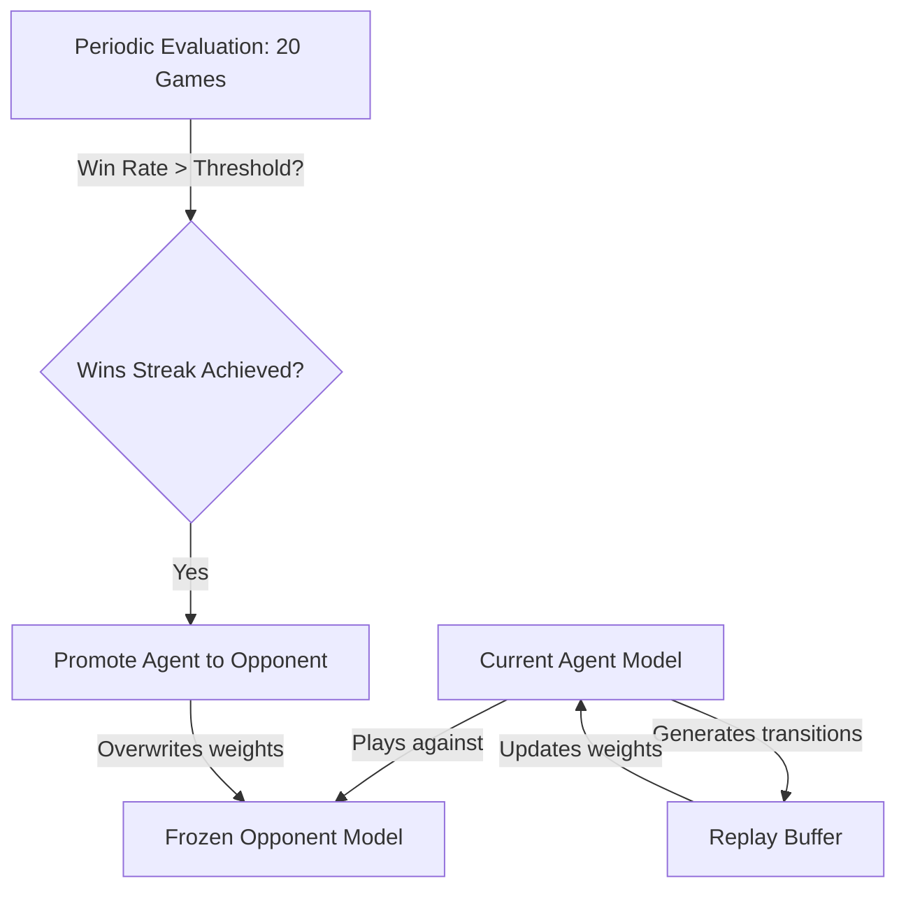

This document explains the DQN training architecture, self-play mechanics, exploration schedules, and the differences between the single-threaded and vectorized implementations in the repository.

---

## 🧠 1. The Core DQN Architecture: `QNetwork`

The network architecture (defined in `black_hole/model.py`) maps the board state to action Q-values:

1. **Board Input Transformation**:
   * Takes the flat board observation and reconstructs the active board into an $L \times L \times 1$ grid ($9 \times 9 \times 1$ for default 9 layers).
   * Hexes store normalized, signed weights: $+v / 22$ if occupied by Player 1, $-v / 22$ if occupied by Player 2, $0$ if empty, and $-1000$ if void (off-board cells).
2. **Convolutional ResNet Backbone**:
   * Processes the grid through an initial $3 \times 3$ Conv2d layer (mapping to 32 channels).
   * Passes the features through three downscaling ResNet blocks (channels double: $32 \to 64 \to 128 \to 256$, with stride-2 downscaling).
3. **MLP Head & Action Masking**:
   * The spatial feature map is flattened and fed to a small MLP stack (`Linear -> BatchNorm -> ReLU`).
   * The output layer maps to 45 logits (representing the 45 board positions).
   * **Masking**: Occupied positions are masked out by setting their values to $-\infty$, ensuring the agent never selects illegal moves.
   * **Scaling**: Softmax is applied to valid logits, and the resulting probabilities are scaled by $100$ to represent Q-values.

---

## 🔄 2. Self-Play & Opponent Promotion

Since Black Hole is a zero-sum game, training requires a dynamic opponent. DQN achieves this via self-play:

* **Canonical View**: The agent is always trained to play as Player 1. If it is Player 2's turn, the board is flipped (1s and 2s are swapped) so the agent thinks it is Player 1.
* **Opponent Promotion**:
  * Every 100 episodes, the current agent is evaluated against the frozen `opponent_model` over 20 games.
  * If the agent wins more than the promotion threshold (e.g., $75\%$ in single-threaded, $60\%$ in vectorized) across a consecutive streak (3 for single-threaded, 1 for vectorized) and minimum training duration has passed, the `opponent_model` is updated with the current agent's weights.
  * This ensures the agent is constantly challenged by a slightly smarter version of itself, preventing policy stagnation.

---

## 🎲 3. Exploration & Cyclic Epsilon Decay

DQN relies on $\epsilon$-greedy exploration to explore new board patterns. The repository implements **Cyclic Epsilon Decay**:

* **The Problem with Standard Decay**: Standard decay drops $\epsilon$ to a low value (like 0.1) and holds it constant. In complex board games, this can cause the policy to converge prematurely on sub-optimal openings.
* **The Cyclic Solution**: Epsilon decays linearly within a "cycle", then restarts back to a higher value.
* **Decaying Peaks**: The peak value of $\epsilon$ at the start of each cycle gradually decreases as training progresses:
  $$\epsilon_{max} = \text{max}(\epsilon_{end}, \epsilon_{start} - \frac{\text{cycle}}{\text{total\_cycles}} \times (\epsilon_{start} - \epsilon_{end}))$$
* This periodically forces the agent to explore new variations early in games while guaranteeing convergence to greedy behavior by the end of training.

---

## ⚡ 4. Single-Threaded vs. Vectorized DQN Training

The repository contains two training pipelines: `train_dqn.py` and `train_dqn_vector.py`.

### A. Single-Threaded DQN (`train_dqn.py`)
* **Execution Flow**: Runs one game environment step-by-step.
* **Wrapper usage**: Uses `SelfPlayWrapper` to intercept Player 2's turn and query the `opponent_model` automatically.
* **Buffer Storage**: Stores single state transitions `(s, a, r, s', done, mask, next_mask)` in a standard replay buffer.
* **Best use case**: Debugging and running on hardware without GPU acceleration.

### B. Vectorized DQN (`train_dqn_vector.py`)
* **Execution Flow**: Spawns **512 parallel game environments** in a single process using Gymnasium's `SyncVectorEnv`.
* **Dynamic Turn Handling**: Standard `SelfPlayWrapper` cannot be used because different environments will be on different players' turns simultaneously. Instead, the training script manually manages turns:
  1. Inspects `obs["current_player"]` across all 512 environments.
  2. For environments on Player 1's turn, the **Agent model** selects moves (using $\epsilon$-greedy or top-3 stochastic softmax).
  3. For environments on Player 2's turn, the **Opponent model** selects moves (by canonicalizing/flipping the boards, performing inference, and getting actions).
  4. Steps all 512 environments in a single vectorized call.
* **Reward Accumulation**: Since Player 2's moves are made automatically, the agent accumulates rewards over multiple environment steps. If Player 2 wins an environment, the accumulated reward for the agent is $-1$; if Player 1 wins, it is $+1$.
* **Replay Buffer**: Batches are generated 512 times faster, saturating the GPU during training steps and accelerating overall runtime by ~10–15x.
